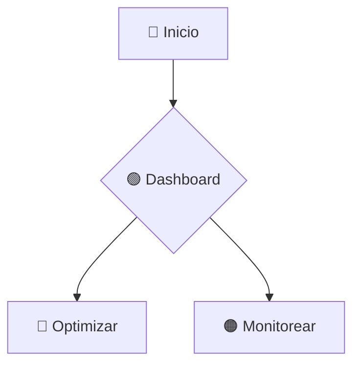

<h1 align="center">🚀 Pixel-Lab | Optimización de Distribución Rural en Cajamarca</h1>

<div align="center">
[](https://reactjs.org/)
[](https://www.typescriptlang.org/)
[](https://www.python.org/)
[](https://flask.palletsprojects.com/)
[](https://opensource.org/licenses/MIT)
</div>

<p align="center">
<strong>Pixel-Lab</strong> es una solución tecnológica innovadora diseñada para optimizar la distribución rural en Cajamarca, Perú. Combina un frontend moderno desarrollado con React y TypeScript con un backend potente en Python (Flask) para ofrecer soluciones inteligentes de ruteo y gestión logística.
</p>

<p align="center">
👉 <a href="https://pixel-lab-ar.netlify.app/"><strong>Demo en Vivo</strong></a> | 🌐 <a href="https://github.com/JairoHuasaja/Pixel-Lab"><strong>Repositorio</strong></a>
</p>

## ✨ Características Destacadas

| Función | Descripción |
|---------|-------------|
| 🛣️ **Optimización de Rutas** | Algoritmos avanzados que reducen costos y tiempos de distribución |
| 📍 **Monitoreo en Tiempo Real** | Seguimiento activo de operaciones logísticas |
| 🗺️ **Visualización Geográfica** | Mapas interactivos para planificación de rutas |
| 📊 **Dashboard Analítico** | Métricas clave para toma de decisiones |
| 🔒 **Gestión de Usuarios** | Sistema seguro de autenticación y roles |

## 🚀 Instalación Local

### Prerrequisitos
```bash
# Verificar versiones
node --version  # Requiere v18+
python --version  # Requiere v3.9+
```
#### Configuración Frontend
```bash
git clone https://github.com/JairoHuasaja/Pixel-Lab.git
cd Pixel-Lab/src

# Instalar dependencias
npm install

# Iniciar servidor de desarrollo
npm run dev

cd ../Api
```
#### Configuración Backend
```bash
# Crear entorno virtual (recomendado)
python -m venv .venv
source .venv/bin/activate  # Linux/macOS
.venv\Scripts\activate     # Windows

# Instalar dependencias
pip install -r requirements.txt

# Iniciar API
flask run
```

## 🧩 Estructura del Proyecto
```text
📦 Pixel-Lab/
├── 📂 src/                   # Frontend (React + TypeScript)
│   ├── 📂 components/        # Componentes reutilizables
│   ├── 📂 pages/             # Vistas principales
│   ├── 📂 utils/             # Utilidades y helpers
│   └── ...                
│
├── 📂 Api/                   # Backend (Python Flask)
│   ├── 📂 app/               # Lógica principal
│   ├── 📂 models/            # Modelos de datos
│   ├── 📂 routes/            # Endpoints API
│   └── ...                
│
├── 📂 docs/                  # Documentación
├── 📂 scripts/               # Scripts de despliegue
└── ...         
```
## 💻 Flujo de Uso


1. Registro/Inicio de sesión con credenciales

2. Explorar dashboard con métricas clave

3. Configurar parámetros de distribución:
- Puntos de recogida
- Destinos finales
- Restricciones vehiculares

4. Generar ruta optimizada con un clic

5. Monitorear operaciones en tiempo real

## 🤝 Contribuir
¡Agradecemos las contribuciones! Sigue estos pasos:

1. 🍴 Haz un fork del repositorio
2. 🌿 Crea una rama 
```bash 
(git checkout -b feature/nueva-funcionalidad) 
```
3. 💻 Realiza tus cambios y commits
4. 🔀 Haz push a tu rama 
``` bash 
(git push origin feature/nueva-funcionalidad) 
```
5. 📦 Abre un Pull Request

## 📄 Licencia
Distribuido bajo licencia MIT. Ver LICENSE para más detalles.

## ✉️ Contacto
- Desarrollador: Jairo Huasaja
- Soporte: dragwarrion@gmail.com

``` diff
+ ¡Clona el repositorio y comienza a optimizar!
git clone https://github.com/JairoHuasaja/Pixel-Lab.git
```

<h2 align="center">Optimizando la logística rural en Perú, un píxel a la vez 🌄</h2>